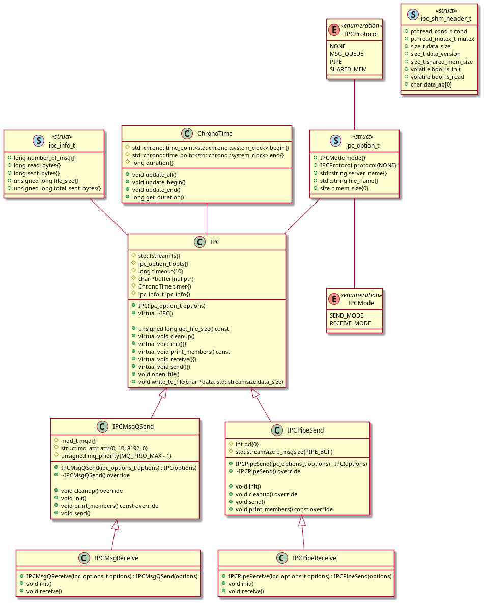
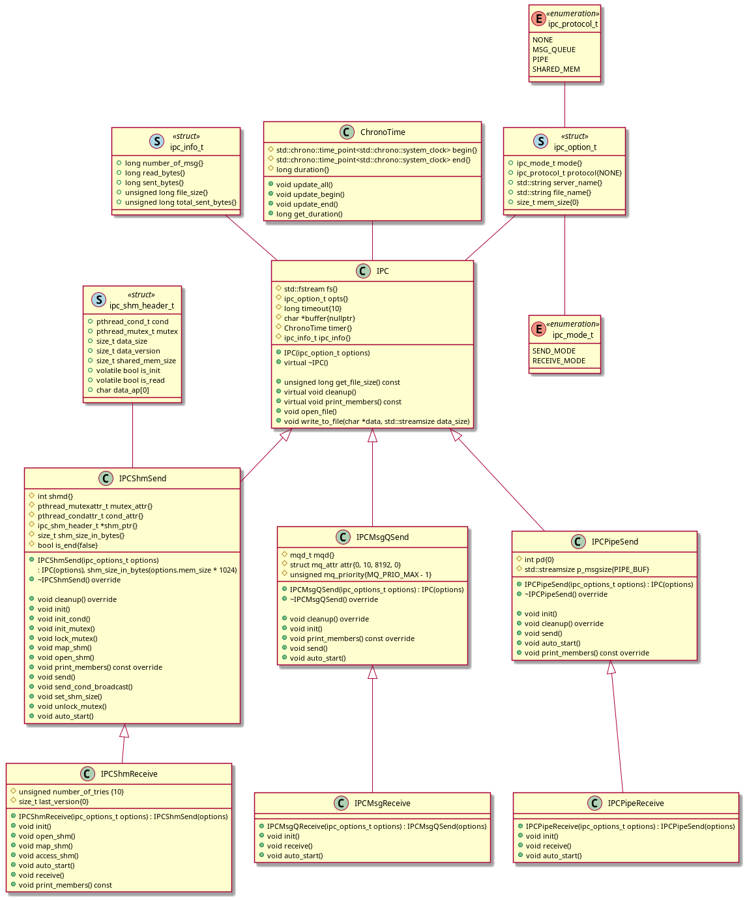

# File transfer using IPC methods

## Build and run test
- Set up environment
```bash
./environmont_setup.sh
```
- Build & run test
```bash
./build_and_test.sh
```

> Note: binaries file and test report are generated under `build` directory.


---

## Usage 

> Note: The programs use a default timeout value of 10 seconds.
> If one side is not started within 10 seconds, the other side will throw timeout error.

### Help
```bash
ipc_send -h
```
### Message queue
- Sender
```bash
ipc_send -q /queue_name -f file_to_send
```

- Receiver
```bash
ipc_receive -q /queue_name -f file_name
```


### Pipe
```bash
ipc_send -p pipe_name -f file_to_send
```

- Receiver
```bash
ipc_receive -p pipe_name -f file_name
```

### Shared Memory
- Sender
- Receiver

---

## Todo
- [x] Message Quue
    - [x] Functional
    - [ ] Test cases
- [ ] Pipe
    - [x] Functional
    - [ ] Test cases
- [ ] Shared Memory
    - [ ] Functional
    - [ ] Test cases
- [x] Scripts
    - [x] `environment_setup.sh`
    - [x] `build_and_test.sh`
- [x] UML
  - [x] Current implementation
  - [x] Future (plan) implementation
- [ ] Documentation (`doxygen`) [Link to documentation](https://baovu-unikie.github.io/file_transfer_cpp/)
- [ ] Test coverage report (`gcov`)

---

## Implementation
### Current


### Plan


---